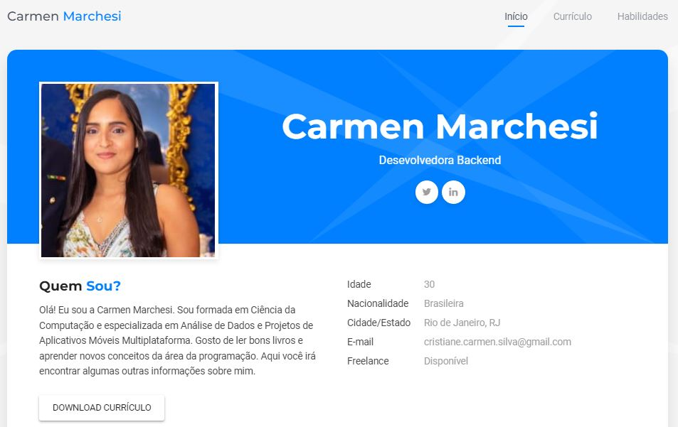

# Currículo Pessoal
---
Criação de repositório que servirá como página pessoal para apresentação do currículo.

[Visualizar a página](https://carmenmarchesi.github.io/)

#

## Sobre o projeto
---
O projeto foi criado após a realização do curso [Git e Github Essencial para o Desenvolvedor](https://www.udemy.com/course/curso-de-git-e-github-essencial), ministrado pela [Geek University](https://www.geekuniversity.com.br/) e cursado através da plataforma de ensino [Udemy](https://www.udemy.com/pt/).